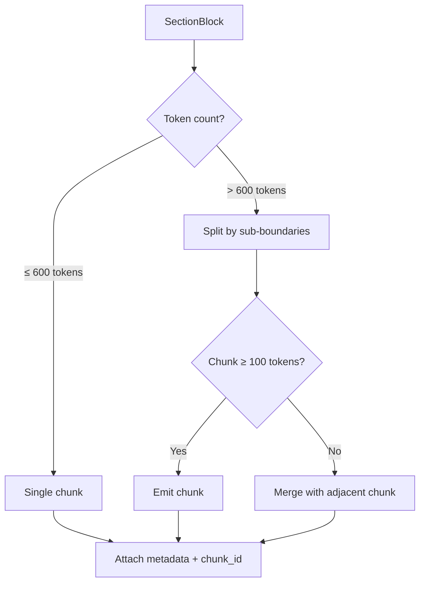
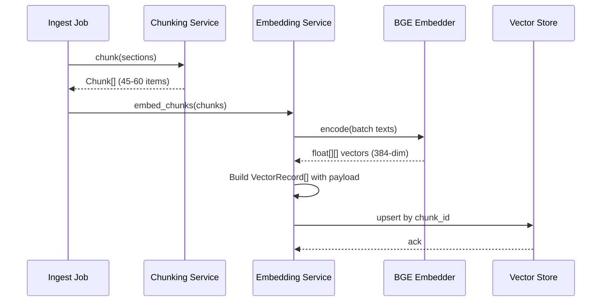
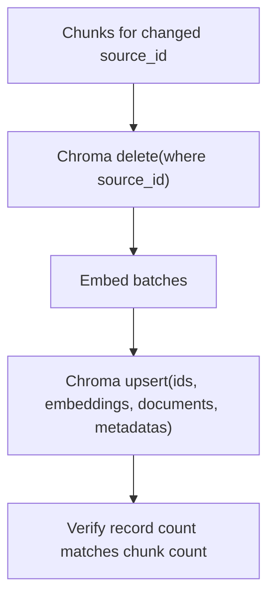
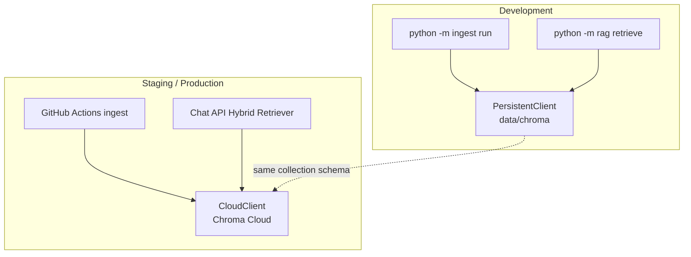

# Chunking & Embedding Architecture

## 1. Document Purpose

This document defines how scraped Groww HTML is transformed into searchable vector embeddings for the Mutual Fund FAQ Assistant. It covers the **Chunking Service** and **Embedding Service** — the two stages that run inside the GitHub Actions ingestion job after scraping and parsing.

**Parent document:** [RAG Architecture](./rag-architecture.md)

**Trigger context:** Both services execute as steps 5–7 inside `python -m ingest run`, scheduled daily at **9:15 AM IST** via `.github/workflows/daily-ingest.yml`.

---

## 2. Position in the Pipeline

```mermaid
flowchart LR
    SCRAPE[Scraping Service] --> PARSE[Parse & Normalize]
    PARSE -->|SectionBlock[]| CHUNK[Chunking Service]
    CHUNK -->|Chunk[]| EMB[Embedding Service]
    EMB -->|VectorRecord[]| VDB[(Chroma<br/>mf_faq_hdfc_groww)]
    EMB --> META[(Metadata Store)]
```

| Stage | Input | Output |
|-------|-------|--------|
| Parse & Normalize | Raw HTML per URL | `SectionBlock[]` — structured text per Groww section |
| **Chunking Service** | `SectionBlock[]` | `Chunk[]` — retrieval-ready text units + metadata |
| **Embedding Service** | `Chunk[]` | `VectorRecord[]` — dense vectors + payload for vector store |

---

## 3. Chunking Service

### 3.1 Design Goals

| Goal | Rationale |
|------|-----------|
| One fact per chunk where possible | Improves retrieval precision for queries like "expense ratio of X" |
| Preserve section context | Chunk text includes section heading prefix for disambiguation |
| Keep tables intact | Exit load slabs and fee tables must not be split mid-row |
| Scheme-scoped metadata | Every chunk is filterable by `source_id` and `scheme_name` |
| Deterministic output | Same HTML → same chunks (reproducible across daily runs) |

### 3.2 Input: SectionBlock

The parser outputs one `SectionBlock` per identifiable Groww page section:

```json
{
  "source_id": "hdfc-large-cap-direct-growth",
  "source_url": "https://groww.in/mutual-funds/hdfc-large-cap-fund-direct-growth",
  "scheme_name": "HDFC Large Cap Fund Direct Growth",
  "scheme_category": "large-cap",
  "section_key": "expense_ratio",
  "section_heading": "Expense Ratio",
  "content": "The expense ratio for Direct Growth plan is 0.96% as on 31 May 2026.",
  "content_type": "text",
  "content_hash": "page-level-sha256"
}
```

**Expected `section_key` values from Groww pages:**

| section_key | Typical content |
|-------------|-----------------|
| `fund_overview` | Category, plan type, launch date |
| `expense_ratio` | TER, expense breakdown |
| `exit_load` | Load slabs, holding period rules |
| `minimum_investment` | Min SIP, min lump sum |
| `lock_in_period` | ELSS lock-in (3 years) |
| `riskometer` | Risk classification |
| `benchmark` | Benchmark index name |
| `fund_manager` | Manager name, experience |
| `aum` | Assets under management |
| `investment_objective` | Scheme objective text |

### 3.3 Chunking Algorithm



**Step-by-step procedure:**

1. **Prefix section context** — Prepend `{scheme_name} — {section_heading}:` to chunk text for embedding context
2. **Count tokens** — Use `tiktoken` (`cl100k_base`) for consistent sizing with embedding model
3. **Small section (≤ 600 tokens)** — Emit as a single chunk
4. **Large section (> 600 tokens)** — Split using sub-boundaries in priority order:
   - Markdown-style headings (`##`, `###`)
   - Newlines (paragraph breaks)
   - Sentence boundaries (`. `)
   - Table rows (for tabular `content_type`)
5. **Apply overlap** — When splitting, include last 60 tokens of previous chunk at start of next chunk
6. **Merge orphans** — Chunks under 100 tokens are merged with the preceding chunk
7. **Assign chunk_id** — `{source_id}-{section_key}-chunk-{NNN}` (zero-padded, sequential per section)
8. **Deduplicate** — Skip chunks whose normalized text hash already exists for the same `source_id`

### 3.4 Chunking Parameters

| Parameter | Value | Notes |
|-----------|-------|-------|
| Target chunk size | 500 tokens | Sweet spot for factual Q&A |
| Max chunk size | 600 tokens | Hard ceiling before forced split |
| Min chunk size | 100 tokens | Below this → merge |
| Overlap | 60 tokens | Only when a section is split |
| Tokenizer | `tiktoken` `cl100k_base` | Chunk sizing only (embedding uses BGE tokenizer) |
| Split strategy | Structure-aware | Headings → paragraphs → sentences → table rows |

### 3.5 Output: Chunk

```json
{
  "chunk_id": "hdfc-large-cap-direct-growth-expense_ratio-chunk-001",
  "source_id": "hdfc-large-cap-direct-growth",
  "source_url": "https://groww.in/mutual-funds/hdfc-large-cap-fund-direct-growth",
  "document_type": "scheme_page",
  "scheme_name": "HDFC Large Cap Fund Direct Growth",
  "scheme_category": "large-cap",
  "section_key": "expense_ratio",
  "section_heading": "Expense Ratio",
  "content_format": "html",
  "text": "HDFC Large Cap Fund Direct Growth — Expense Ratio: The expense ratio for Direct Growth plan is 0.96% as on 31 May 2026.",
  "token_count": 42,
  "chunk_index": 1,
  "content_hash": "page-level-sha256",
  "text_hash": "chunk-level-sha256",
  "indexed_at": null
}
```

### 3.6 Chunking per Scheme (Expected Volume)

| Scheme | Est. sections | Est. chunks per page | Notes |
|--------|---------------|----------------------|-------|
| HDFC Mid Cap Fund | ~10 | 8–12 | Standard equity page |
| HDFC Equity Fund | ~10 | 8–12 | Standard equity page |
| HDFC Focused Fund | ~10 | 8–12 | Standard equity page |
| HDFC ELSS Tax Saver | ~11 | 9–13 | Extra lock-in section |
| HDFC Large Cap Fund | ~10 | 8–12 | Standard equity page |
| **Total corpus** | — | **~45–60 chunks** | Small, high-precision index |

### 3.7 Chunking Module Structure

```
ingest/
├── chunking/
│   ├── __init__.py
│   ├── chunker.py          # Main ChunkingService class
│   ├── splitter.py         # Token-aware text splitting
│   ├── tokenizer.py        # tiktoken wrapper
│   └── models.py           # SectionBlock, Chunk dataclasses
```

**Core interface:**

```python
class ChunkingService:
    def chunk(self, sections: list[SectionBlock]) -> list[Chunk]:
        """Transform parsed sections into retrieval-ready chunks."""
        ...

    def chunk_page(self, sections: list[SectionBlock]) -> list[Chunk]:
        """Chunk all sections for a single scheme page."""
        ...
```

### 3.8 Re-indexing Behavior on Daily Run

When GitHub Actions runs at 9:15 AM IST:

| Scenario | Chunking action |
|----------|-----------------|
| Content hash unchanged | Skip chunking for that URL |
| Content hash changed | Delete old chunks for `source_id`, re-chunk entire page |
| `FORCE_REINDEX=true` | Re-chunk all 5 pages regardless of hash |
| New section detected | New `section_key` → new chunks with new IDs |
| Section removed from page | Orphan chunks deleted during upsert |

---

## 4. Embedding Service

### 4.1 Design Goals

| Goal | Rationale |
|------|-----------|
| Semantic search over factual text | Users ask in natural language; embeddings capture meaning |
| Consistent model across ingest and query | Same model for indexing and retrieval query embedding |
| Batch efficiency | Local batch encoding on GitHub Actions runner |
| Idempotent upserts | Re-running embed step does not duplicate vectors |

### 4.2 Embedding Model Selection

| Option | Model | Dimensions | Use case |
|------|-------|------------|----------|
| **Primary (v1)** | `BAAI/bge-small-en-v1.5` | 384 | Local inference via `sentence-transformers`; no API key |
| Alternative | `text-embedding-3-small` | 1536 | OpenAI API (`EMBEDDING_PROVIDER=openai`) |
| Test / offline | `hash` | configurable | Deterministic vectors (`EMBEDDING_PROVIDER=hash`) |

**v1 decision:** `BAAI/bge-small-en-v1.5` — runs locally on the GitHub Actions runner and in dev, with no external embedding API dependency.

| Property | Value |
|----------|-------|
| Provider | `bge` (HuggingFace `sentence-transformers`) |
| Model | `BAAI/bge-small-en-v1.5` |
| Dimensions | 384 |
| Max sequence length | 512 tokens |
| Distance metric | Cosine similarity (normalized embeddings) |
| Query prefix | `Represent this sentence for searching relevant passages: ` |
| Library | `sentence-transformers` |

### 4.3 What Gets Embedded

Each chunk's `text` field is embedded **without** a query prefix. The prefixed chunk text ensures the vector encodes both scheme identity and section:

```
HDFC Large Cap Fund Direct Growth — Expense Ratio: The expense ratio for Direct Growth plan is 0.96% as on 31 May 2026.
```

**Not embedded separately:** Metadata fields (`source_id`, `section_key`, etc.) are stored as vector payload, not in the embedding input.

### 4.4 Embedding Pipeline



### 4.5 Batch Processing

| Parameter | Value |
|-----------|-------|
| Batch size | 32 chunks per encode call |
| Normalize embeddings | `true` (recommended for cosine similarity) |
| Model load | Lazy on first encode; cached for run duration |
| Expected encode latency | < 15 seconds total (including first model load) |
| Re-index on model change | Required (`FORCE_REINDEX=true`) when switching models |

**Encode input example (documents — no query prefix):**

```python
[
  "HDFC Large Cap Fund Direct Growth — Expense Ratio: The expense ratio...",
  "HDFC Large Cap Fund Direct Growth — Exit Load: Exit load of 1% if redeemed...",
  "HDFC Mid Cap Fund Direct Growth — Minimum Investment: Minimum SIP is ₹100...",
]
```

### 4.6 Output: VectorRecord

```json
{
  "id": "hdfc-large-cap-direct-growth-expense_ratio-chunk-001",
  "vector": [0.0123, -0.0456, ...],
  "payload": {
    "chunk_id": "hdfc-large-cap-direct-growth-expense_ratio-chunk-001",
    "source_id": "hdfc-large-cap-direct-growth",
    "source_url": "https://groww.in/mutual-funds/hdfc-large-cap-fund-direct-growth",
    "scheme_name": "HDFC Large Cap Fund Direct Growth",
    "scheme_category": "large-cap",
    "section_key": "expense_ratio",
    "section_heading": "Expense Ratio",
    "document_type": "scheme_page",
    "text": "HDFC Large Cap Fund Direct Growth — Expense Ratio: ...",
    "token_count": 42,
    "content_hash": "page-level-sha256",
    "indexed_at": "2026-06-05T09:15:45+05:30"
  }
}
```

### 4.7 Vector Store Upsert Strategy (Chroma)

Vector storage uses **[Chroma](https://www.trychroma.com/)** — open-source search infrastructure for AI. Local development uses a persistent client; staging and production target **Chroma Cloud** (see §10 Phase 5.3).

| Component | Value |
|-----------|-------|
| Vector store | **Chroma** — `PersistentClient` (dev) / `CloudClient` (staging, prod) |
| Collection name | `mf_faq_hdfc_groww` |
| ID field | `chunk_id` (string, used as Chroma record ID) |
| Embedding dimensions | 384 (BGE-small, normalized) |
| Distance | Cosine (`metadata: {"hnsw:space": "cosine"}`) |
| Document field | Chunk `text` stored in Chroma `documents` for retrieval display |

**Upsert rules:**

1. **Delete-then-insert per source** — When a page's content hash changes, `collection.delete(where={"source_id": source_id})`, then `collection.upsert(...)`
2. **Record ID = chunk_id** — Enables idempotent re-runs
3. **Metadata filter fields** — `source_id`, `scheme_name`, `section_key` (Chroma `where` pre-filtering at query time)
4. **No full rebuild** — Only changed schemes are re-indexed on daily runs
5. **Verify after upsert** — `collection.get(where={"source_id": source_id})` count must equal chunk count



### 4.8 Query-Time Embedding

At retrieval time (chat API), the user's question is embedded with the **same model**:

```python
query_vector = embedding_service.embed_query("What is the expense ratio of HDFC Large Cap Fund?")
results = vector_store.search(
    vector=query_vector,
    limit=10,
    filter={"scheme_name": "HDFC Large Cap Fund Direct Growth"}  # optional
)
```

| Query embedding | Ingest embedding |
|-----------------|------------------|
| Same model: `BAAI/bge-small-en-v1.5` | Same model: `BAAI/bge-small-en-v1.5` |
| Query prefix applied | No query prefix on chunk text |
| Single string input | Batch input |
| Called per chat message | Called per changed page on daily run |

### 4.9 Embedding Module Structure

```
phases/phase2_rag_core/embedding/
├── __init__.py
├── embedder.py         # EmbeddingService class
├── bge_embedder.py     # BGE local embedder (primary)
├── openai_embedder.py  # OpenAI + hash embedders (optional)
├── vector_store.py     # Chroma local + Cloud upsert logic (Phase 5.3)
└── models.py           # VectorRecord dataclass
```

**Core interface:**

```python
class EmbeddingService:
    def embed_chunks(self, chunks: list[Chunk]) -> list[VectorRecord]:
        """Batch-embed chunks and return vector records."""
        ...

    def embed_query(self, query: str) -> list[float]:
        """Embed a single query string for retrieval."""
        ...

    def upsert(self, records: list[VectorRecord], source_id: str) -> UpsertResult:
        """Delete old vectors for source_id, insert new records."""
        ...
```

---

## 5. End-to-End Data Flow (Single Scheme)

Example: HDFC Large Cap Fund page changes on daily scrape.

```
1. SCRAPE
   GET https://groww.in/mutual-funds/hdfc-large-cap-fund-direct-growth
   → HTML (content_hash changed)

2. PARSE
   → 10 SectionBlocks (expense_ratio, exit_load, minimum_investment, ...)

3. CHUNK
   → 11 Chunks (most sections = 1 chunk; investment_objective = 2 chunks)

4. EMBED
   → 11 vectors (384-dim, single BGE encode batch)

5. UPSERT (Chroma)
   → collection.delete(where source_id = hdfc-large-cap-direct-growth)
   → collection.upsert 11 records into mf_faq_hdfc_groww

6. REGISTRY UPDATE
   → last_fetched = 2026-06-05T09:15:12+05:30
```

---

## 6. Error Handling

### 6.1 Chunking Errors

| Error | Action |
|-------|--------|
| Empty section content | Skip section; log warning |
| Section exceeds 600 tokens, split fails | Force split at sentence boundary |
| Duplicate text_hash | Skip duplicate chunk |
| Zero chunks produced for a page | Mark URL as `failed`; keep previous index |

### 6.2 Embedding Errors

| Error | Action |
|-------|--------|
| Model load failure | Fail workflow; log HuggingFace download error |
| Dimension mismatch | Delete collection; re-index with `FORCE_REINDEX=true` |
| Chunk exceeds 8191 tokens | Truncate to 600 tokens before embed (should not happen post-chunking) |
| Chroma Cloud unreachable / auth failure | Fail workflow; GitHub Actions marks job failed; retain last index |
| Upsert count mismatch | Rollback delete; fail page; keep previous index |

---

## 7. Configuration

```yaml
# config/chunking.yaml
chunking:
  target_tokens: 500
  max_tokens: 600
  min_tokens: 100
  overlap_tokens: 60
  tokenizer: cl100k_base
  context_prefix: "{scheme_name} — {section_heading}: "

# config/embedding.yaml
embedding:
  provider: bge
  model: BAAI/bge-small-en-v1.5
  dimensions: 384
  batch_size: 32
  normalize_embeddings: true
  query_prefix: "Represent this sentence for searching relevant passages: "

vector_store:
  provider: chroma
  mode: local          # local | cloud (auto: cloud when CHROMA_API_KEY set)
  collection: mf_faq_hdfc_groww
  distance: cosine
  persist_dir: data/chroma
  tenant: ""            # Chroma Cloud tenant (cloud mode)
  database: mf-faq-prod # Chroma Cloud database (cloud mode)
```

**Environment variables:**

| Variable | Used by |
|----------|---------|
| `EMBEDDING_PROVIDER` | Override provider (`bge`, `hash`, `openai`) |
| `OPENAI_API_KEY` | Only when `EMBEDDING_PROVIDER=openai` |
| `CHROMA_API_KEY` | Chroma Cloud authentication (staging/prod) |
| `CHROMA_TENANT` | Chroma Cloud tenant ID |
| `CHROMA_DATABASE` | Chroma Cloud database name |
| `CHROMA_HOST` | Optional Chroma Cloud host override |
| `VECTOR_STORE_MODE` | Force `local` or `cloud` (default: infer from `CHROMA_API_KEY`) |
| `FORCE_REINDEX` | Skip change detection when `true` |

---

## 8. Monitoring & Validation

### 8.1 Metrics (logged in run summary)

| Metric | Target |
|--------|--------|
| Chunks per page | 8–13 |
| Total corpus size | 45–60 chunks |
| Embed API latency | < 10s per run |
| Upsert success rate | 100% |
| Chunk token count (p95) | ≤ 600 |

### 8.2 Validation Checks (post-ingest)

1. Point count in `mf_faq_hdfc_groww` matches expected chunk count
2. Every point has non-empty `source_url` from allowlist
3. Every `section_key` in `KNOWN_SECTIONS` or logged as new
4. Sample similarity search returns relevant chunk for 5 golden queries

### 8.3 Golden Query Smoke Test

Run after each ingest inside the GitHub Actions job:

| Query | Expected top chunk section_key |
|-------|-------------------------------|
| "expense ratio of HDFC Large Cap Fund" | `expense_ratio` |
| "exit load HDFC Mid Cap" | `exit_load` |
| "minimum SIP HDFC Focused Fund" | `minimum_investment` |
| "ELSS lock-in period" | `lock_in_period` |
| "benchmark of HDFC Equity Fund" | `benchmark` |

---

## 9. Summary

| Service | Responsibility | Runs when |
|---------|----------------|-----------|
| **Chunking Service** | Split parsed Groww sections into 400–600 token chunks with scheme/section metadata | Content hash changed (or force reindex) |
| **Embedding Service** | Batch-embed chunk text via `BAAI/bge-small-en-v1.5`; upsert to Chroma `mf_faq_hdfc_groww` | Immediately after chunking |

Both services are invoked by `python -m ingest run` inside the **GitHub Actions** daily workflow at 9:15 AM IST, producing a small (~50 chunk), high-precision Chroma index scoped to five HDFC schemes on Groww.

---

## 10. Phase 5.3 — Chroma Vector Store (Implemented)

**Parent:** [RAG Architecture §5.6](./rag-architecture.md#56-vector-store--chroma-phase-53)

Phase 5.3 migrates the vector store layer to a unified **Chroma** backend: local persistent storage for development and **Chroma Cloud** for staging/production ingest and query. No implementation in this milestone — architecture and steps only.

### 10.1 Goals

| Goal | Rationale |
|------|-----------|
| Single vector store vendor | Replace Qdrant alternate path; simplify ops |
| Dev/prod parity | Same `chromadb` client API locally and in Cloud |
| Managed ingest target | GitHub Actions upserts directly to Chroma Cloud |
| Metadata-native filtering | Scheme and section filters via Chroma `where` clauses |
| Future sparse search | Chroma supports BM25/SPLADE sparse vectors for hybrid retrieval evolution |

### 10.2 Architecture



### 10.3 Implementation steps

| Step | Description | Output |
|------|-------------|--------|
| **5.3.1** | Create Chroma Cloud account; provision tenant + database; generate API key | `CHROMA_API_KEY`, `CHROMA_TENANT`, `CHROMA_DATABASE` secrets |
| **5.3.2** | Add `vector_store.mode`, `tenant`, `database` to `config/embedding.yaml` | Config schema |
| **5.3.3** | Refactor `vector_store.py`: `ChromaVectorStore` with `PersistentClient` / `CloudClient` factory; remove Qdrant branch | Code |
| **5.3.4** | Update `EmbeddingService.from_config_files()` to select client by mode | Code |
| **5.3.5** | Update `.github/workflows/daily-ingest.yml` with `CHROMA_*` secrets (remove `VECTOR_STORE_URL`) | CI |
| **5.3.6** | Run `FORCE_REINDEX=true python -m ingest run` against Cloud to seed collection | ~50 vectors in `mf_faq_hdfc_groww` |
| **5.3.7** | Extend `python -m rag validate-index` — Cloud connectivity, collection exists, allowlist URLs | Validation |
| **5.3.8** | Add tests: `EphemeralClient` for unit tests; optional Cloud smoke test (manual / nightly) | Tests |
| **5.3.9** | Update README with local vs Cloud setup instructions | Docs |

### 10.4 Chroma client selection

```python
def create_chroma_client(config: VectorStoreConfig) -> chromadb.ClientAPI:
    mode = os.getenv("VECTOR_STORE_MODE") or (
        "cloud" if os.getenv("CHROMA_API_KEY") else config.mode or "local"
    )
    if mode == "cloud":
        return chromadb.CloudClient(
            tenant=os.environ["CHROMA_TENANT"],
            database=os.environ.get("CHROMA_DATABASE", config.database),
            api_key=os.environ["CHROMA_API_KEY"],
        )
    persist_dir = project_root / config.persist_dir
    return chromadb.PersistentClient(path=str(persist_dir))
```

### 10.5 Validation checks (post Phase 5.3)

Extends §8.2:

1. Chroma collection `mf_faq_hdfc_groww` exists and is reachable
2. Record count matches expected chunk count (45–60)
3. Every record has `source_url` from allowlist
4. Metadata filter `where={"section_key": "expense_ratio"}` returns ≥ 1 record
5. Dense query against Cloud returns golden-query top hit (§8.3)

### 10.6 Out of scope for 5.3

- Chroma native sparse/BM25 vectors (hybrid sparse leg stays in-memory BM25 from Phase 5.2)
- Collection forking / A/B testing (Chroma feature; future eval phase)
- Multi-region replication (enterprise Chroma; not needed for ~50 chunks)
