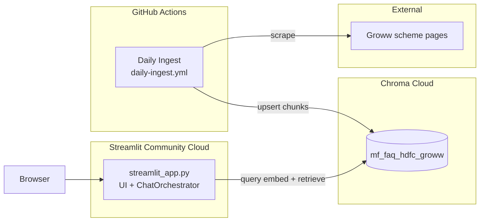
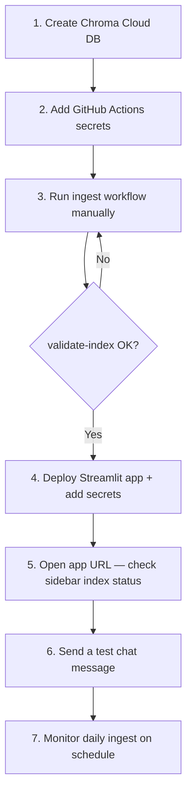

# Deployment Plan — Mutual Fund FAQ Assistant

## 1. Document Purpose

This document describes how to deploy the Mutual Fund FAQ Assistant to production.

**Recommended (single app):**

| Component | Platform | Role |
|-----------|----------|------|
| **Chat UI + RAG** | Streamlit Community Cloud | `streamlit_app.py` — UI and orchestrator in one process |
| **Scheduler / ingest** | GitHub Actions | Daily scrape → chunk → embed → Chroma Cloud upsert |
| **Vector store** | Chroma Cloud | Shared index used by ingest and the Streamlit app |

**Alternative (split stack):** FastAPI on Render + Next.js on Vercel — see [§7 Alternative — Render + Vercel](#7-alternative--render--vercel).

Ingest stays on GitHub Actions in both setups. The Streamlit app loads BGE for query embedding at runtime; ingest embeds documents offline on CI runners.

---

## 2. Target Architecture (Streamlit)



**Request path (chat):** Browser → Streamlit → BGE query embed → Chroma retrieve → extractive generation → rendered reply.

**Offline path (ingest):** GitHub Actions cron → scrape 5 Groww URLs → parse/chunk → BGE document embed → Chroma upsert.

---

## 3. Prerequisites

Before deploying, ensure you have:

1. **GitHub repository** with this codebase pushed to `main` (or your production branch).
2. **Chroma Cloud** account and a database (e.g. `testDB`) with API credentials from [trychroma.com](https://www.trychroma.com/).
3. **Streamlit Community Cloud** account — [share.streamlit.io](https://share.streamlit.io) (linked to GitHub).
4. **Initial index populated** — run `python -m ingest run` locally once, or trigger the GitHub Actions workflow after secrets are configured.

---

## 4. Shared Configuration (Chroma Cloud)

Both GitHub Actions (ingest) and the Streamlit app must point at the **same** Chroma Cloud database and collection.

| Variable | Example | Used by |
|----------|---------|---------|
| `CHROMA_API_KEY` | `ck-...` | Ingest + Streamlit |
| `CHROMA_TENANT` | tenant UUID | Ingest + Streamlit |
| `CHROMA_DATABASE` | `testDB` | Ingest + Streamlit |
| `CHROMA_HOST` | `api.trychroma.com` | Ingest + Streamlit (default) |
| `VECTOR_STORE_MODE` | `cloud` | Ingest + Streamlit |

Store these as secrets in GitHub (Actions) and Streamlit (app secrets). **Never commit real values to the repo.**

---

## 5. Scheduler — GitHub Actions

### 5.1 What already exists

The workflow [`.github/workflows/daily-ingest.yml`](../.github/workflows/daily-ingest.yml) is production-ready:

- **Schedule:** daily at **9:15 AM IST** (`cron: '45 3 * * *'` UTC)
- **Manual trigger:** `workflow_dispatch` with optional `force_reindex`
- **Pipeline:** scrape → parse → chunk → BGE embed → Chroma upsert → `validate-index`
- **Artifacts:** run summary (30 days), raw HTML snapshots (7 days)
- **Caching:** BGE model (`.cache/huggingface`) and scrape metadata (`data/metadata`)

### 5.2 Repository secrets

In **GitHub → Settings → Secrets and variables → Actions**, add:

| Secret | Required |
|--------|----------|
| `CHROMA_API_KEY` | Yes |
| `CHROMA_TENANT` | Yes |
| `CHROMA_DATABASE` | Yes |

No Render or Vercel secrets are needed for the scheduler.

### 5.3 First run & verification

1. Push the repo to GitHub.
2. Go to **Actions → Daily Ingest Pipeline → Run workflow**.
3. Confirm the job completes and `validate-index` passes.
4. Check artifacts for `/tmp/run-summary.json` if you need run-level diagnostics.

### 5.4 Operational notes

| Topic | Detail |
|-------|--------|
| **Concurrency** | `concurrency.group: ingest-pipeline` — only one ingest at a time |
| **Timeout** | 45 minutes (sufficient for 5 URLs + BGE on `ubuntu-latest`) |
| **Python version** | 3.11 on CI (local dev may use 3.9+) |
| **Force reindex** | Use `workflow_dispatch` + `force_reindex: true` after embedding model or chunking changes |
| **Collection reset** | Set `CHROMA_RESET_COLLECTION=true` as a workflow `env` override only when changing embedding dimensions |

---

## 6. Streamlit App — Community Cloud

The chat UI and RAG pipeline run in a single file: [`streamlit_app.py`](../streamlit_app.py). It calls `ChatOrchestrator` directly — no FastAPI or Next.js required.

### 6.1 Local run

```bash
source .venv/bin/activate
pip install -r requirements.txt
cp .env.example .env   # add Chroma credentials

streamlit run streamlit_app.py
```

Open **http://localhost:8501**.

### 6.2 Deploy on Streamlit Community Cloud

1. Push the repo to GitHub (include `streamlit_app.py`, `requirements.txt`, `.streamlit/config.toml`).
2. Go to [share.streamlit.io](https://share.streamlit.io) → **Create app**.
3. Connect your GitHub repo and branch.
4. Set **Main file path:** `streamlit_app.py`
5. **App URL** will be `https://<app-name>.streamlit.app`

Streamlit auto-installs dependencies from root `requirements.txt` (which includes `-r requirements-api.txt` + `streamlit`).

### 6.3 App secrets (Streamlit Cloud)

In the app dashboard → **Settings → Secrets**, add:

```toml
CHROMA_API_KEY = "your-key"
CHROMA_TENANT = "your-tenant-id"
CHROMA_DATABASE = "testDB"
CHROMA_HOST = "api.trychroma.com"
VECTOR_STORE_MODE = "cloud"
EMBEDDING_PROVIDER = "bge"
GENERATION_PROVIDER = "extractive"
```

**Important:** `CHROMA_DATABASE` must be **`testDB`** — the same value as GitHub Actions ingest secrets and your local `.env`. If this is missing or wrong, the sidebar will show **Index empty · 0 chunks**.

See [`.streamlit/secrets.toml.example`](../.streamlit/secrets.toml.example) in the repo.

Optional: `OPENAI_API_KEY` only if `GENERATION_PROVIDER=openai`.

### 6.4 Memory & cold starts

The app loads **BAAI/bge-small-en-v1.5** on first chat (cached via `@st.cache_resource` after first load). Streamlit Community Cloud free apps have limited RAM; if the app crashes on first message:

- Retry after redeploy (model may cache on disk within the session)
- Consider Streamlit paid workspace for more resources
- First load can take 30–60 seconds while the embedding model downloads

The sidebar shows **index health** (chunk count from Chroma).

### 6.5 Features mirrored from Next.js UI

- Disclaimer banner (“Facts-only. No investment advice.”)
- Example questions
- Chat history per conversation (`st.session_state`)
- **New conversation** button in sidebar
- Scheme list and index status in sidebar
- Source links on assistant replies

---

## 7. Alternative — Render + Vercel

Use this split stack if you prefer the existing Next.js UI (`phases/phase5_ui/web`) and a separate FastAPI API.

### 7.1 Backend — Render

Create a **Web Service** (not a cron job — ingestion stays on GitHub Actions).

| Setting | Value |
|---------|-------|
| **Repository** | This GitHub repo |
| **Root directory** | *(repo root — leave blank)* |
| **Runtime** | Python 3 |
| **Build command** | `pip install -r requirements-api.txt` |
| **Start command** | `python -m api --host 0.0.0.0 --port $PORT` |

Render injects `$PORT`; the API must bind to `0.0.0.0`, not `127.0.0.1`.

### 7.2 Instance sizing

The API loads **BAAI/bge-small-en-v1.5** locally for query embedding (`EMBEDDING_PROVIDER=bge`). Recommended:

| Plan | RAM | Notes |
|------|-----|-------|
| **Minimum** | 512 MB | May OOM on cold start; test carefully |
| **Recommended** | 1 GB+ | Stable BGE + FastAPI + Chroma client |

Free-tier services **spin down after inactivity** (~15 s cold start + ~10 s first BGE load). Use a paid instance or an external uptime ping if you need consistent latency.

### 7.3 Environment variables (Render)

| Variable | Value | Required |
|----------|-------|----------|
| `CHROMA_API_KEY` | Chroma Cloud key | Yes |
| `CHROMA_TENANT` | Tenant ID | Yes |
| `CHROMA_DATABASE` | e.g. `testDB` | Yes |
| `CHROMA_HOST` | `api.trychroma.com` | Yes |
| `VECTOR_STORE_MODE` | `cloud` | Yes |
| `EMBEDDING_PROVIDER` | `bge` | Yes (default) |
| `GENERATION_PROVIDER` | `extractive` | Yes (default; no OpenAI key needed) |
| `HF_HOME` | `/opt/render/project/src/.cache/huggingface` | Recommended |
| `OPENAI_API_KEY` | — | Only if `GENERATION_PROVIDER=openai` |

`HF_HOME` keeps the embedding model cache inside the Render filesystem across restarts on the same instance (still re-downloads after redeploys unless you add a persistent disk).

### 7.4 Health check

Configure Render health check path:

```
/api/health
```

Expected response:

```json
{"status":"ok","indexed_chunks":30,"collection":"mf_faq_hdfc_groww"}
```

`indexed_chunks` should be ≥ 1 after a successful ingest.

### 7.5 API surface

| Method | Path | Purpose |
|--------|------|---------|
| `GET` | `/api/health` | Liveness + index status |
| `POST` | `/api/chat` | Send a message (creates thread if omitted) |
| `POST` | `/api/threads` | Create empty thread |
| `GET` | `/api/threads/{id}` | Fetch thread history |
| `DELETE` | `/api/threads/{id}` | Delete thread |
| `GET` | `/docs` | OpenAPI (Swagger) UI |

CORS is already open (`allow_origins=["*"]`) in `phases/phase4_api/api/app.py`, so direct browser calls to Render work if needed. In production, traffic should go through Vercel rewrites.

### 7.6 Known limitations on Render

| Limitation | Impact | Mitigation (future) |
|------------|--------|---------------------|
| **In-memory sessions** | Threads lost on restart or scale-out | Redis / DB-backed `SessionStore` |
| **Cold starts** | First chat after idle is slow | Paid plan, keep-warm ping, or `EMBEDDING_PROVIDER=openai` |
| **Single instance** | No horizontal scaling without shared sessions | External session store |
| **No ingest on Render** | Index only updates via GitHub Actions | By design |

### 7.7 Frontend — Vercel

| Setting | Value |
|---------|-------|
| **Framework preset** | Next.js |
| **Root directory** | `phases/phase5_ui/web` |
| **Build command** | `npm run build` (default) |
| **Output** | Next.js default |
| **Install command** | `npm install` (default) |

Import the GitHub repo in Vercel and set the root directory to `phases/phase5_ui/web` — do not deploy from the monorepo root.

### 7.8 Environment variables (Vercel)

| Variable | Value | Environment |
|----------|-------|-------------|
| `API_URL` | `https://<your-render-service>.onrender.com` | Production (and Preview if previews should hit a staging API) |

`API_URL` is read at **build time** by [`next.config.ts`](../phases/phase5_ui/web/next.config.ts) for rewrite rules:

```ts
// Browser calls /api/chat → proxied to ${API_URL}/api/chat
destination: `${apiUrl}/api/:path*`
```

After changing `API_URL`, **redeploy** the Vercel project so rewrites pick up the new backend URL.

### 7.9 Domains

| Environment | Typical URL |
|-------------|-------------|
| Production | `https://<project>.vercel.app` or custom domain |
| Preview | Per-PR preview URLs (optional separate `API_URL` for staging API) |

### 7.10 Local vs production (Render + Vercel)

| | Local | Production |
|---|-------|------------|
| UI | `http://localhost:3000` | Vercel URL |
| API | `http://127.0.0.1:8000` | Render URL |
| Proxy | `API_URL` defaults to localhost | `API_URL` = Render HTTPS URL |

---

## 8. Deployment Sequence (Streamlit)



### Smoke-test checklist

- [ ] GitHub Actions ingest completes with `validate-index` passing
- [ ] Streamlit sidebar shows **Index OK** with `indexed_chunks > 0`
- [ ] Ask “What is the expense ratio of HDFC Mid Cap Fund?” → answer + source link
- [ ] **New conversation** clears the thread
- [ ] Daily ingest succeeds on schedule (or manual trigger)

---

## 9. Secrets & Environment Matrix

| Variable | GitHub Actions | Streamlit | Render | Vercel |
|----------|:--------------:|:---------:|:------:|:------:|
| `CHROMA_API_KEY` | Secret | Secret | Env | — |
| `CHROMA_TENANT` | Secret | Secret | Env | — |
| `CHROMA_DATABASE` | Secret | Secret | Env | — |
| `CHROMA_HOST` | Default in workflow | Secret | Env | — |
| `EMBEDDING_PROVIDER` | `bge` in workflow | Secret | Env | — |
| `GENERATION_PROVIDER` | — | Secret | Env | — |
| `OPENAI_API_KEY` | — | Optional | Optional | — |
| `HF_HOME` | Workflow env | — | Env | — |
| `API_URL` | — | — | — | Env |
| `FORCE_REINDEX` | Workflow input | — | — | — |

---

## 10. Monitoring & Operations

### 10.1 GitHub Actions (ingest)

- **Success signal:** green workflow run + `validate-index` step
- **Failure alerts:** enable GitHub email notifications or a Slack webhook on workflow failure
- **Artifacts:** `ingest-run-summary-<run_id>` for chunk counts and per-URL status

### 10.2 Streamlit (app)

- App logs in Streamlit Cloud dashboard (OOM, import errors, Chroma auth failures)
- Sidebar health indicator turns warning/error if Chroma is unreachable
- First chat after cold start may be slow while BGE loads

### 10.3 Render (API) — alternative stack only

- Use Render dashboard metrics (CPU, memory, restarts)
- Alert on health check failures
- Watch for OOM kills when using BGE on small instances

### 10.4 Vercel (UI) — alternative stack only

- Deployment logs for build failures (often missing `API_URL` or wrong root directory)
- Vercel Analytics (optional) for traffic

### 10.5 Data freshness

Answers reflect the last successful ingest. The UI shows **last updated from sources** per response. If Groww pages change mid-day, users see stale data until the next **9:15 AM IST** run (or a manual `workflow_dispatch`).

---

## 11. Optional Enhancements (Post-v1)

| Enhancement | Platform | Benefit |
|-------------|----------|---------|
| Staging Render service + Vercel preview `API_URL` | Render + Vercel | Safe pre-prod testing |
| Render persistent disk for `HF_HOME` | Render | Faster cold starts after deploy |
| `GENERATION_PROVIDER=openai` | Render | Richer answers (adds cost + key management) |
| Redis for `SessionStore` | Render + Upstash | Durable threads across restarts |
| Custom domain + HTTPS | Vercel + Render | Branded URLs |
| Branch protection + required Actions check | GitHub | Block merges if ingest tests fail |

---

## 12. Rollback

| Layer | Rollback |
|-------|----------|
| **Streamlit app** | Reboot app or redeploy previous commit from Streamlit dashboard |
| **UI (Vercel)** | Redeploy previous Vercel deployment |
| **API (Render)** | Roll back to previous Render deploy |
| **Index** | Re-run ingest with `force_reindex: false`; for bad upserts, use `CHROMA_RESET_COLLECTION=true` once then re-ingest |
| **Scheduler** | Revert workflow file on `main`; disable schedule in workflow YAML if needed |

---

## 13. Related Documentation

- [RAG Architecture](./rag-architecture.md) — system design, scheduler spec (§5.1), Chroma model (§6)
- [Chunking & Embedding Architecture](./chunking-embedding-architecture.md) — index shape and embedding config
- [README](../README.md) — local setup and CLI commands
- [Phase 5 UI README](../phases/phase5_ui/README.md) — frontend build notes
