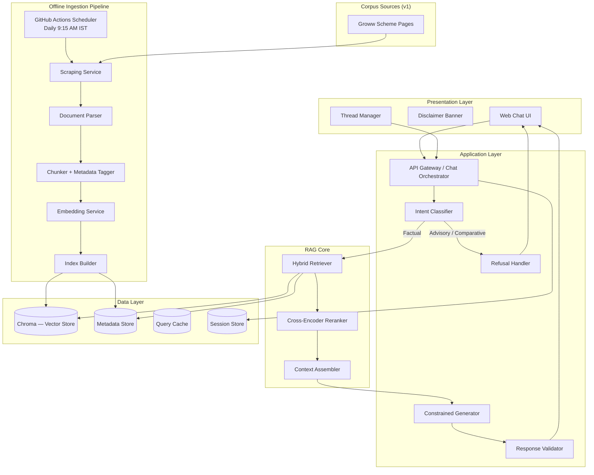
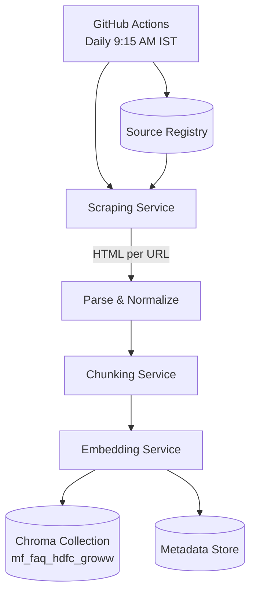
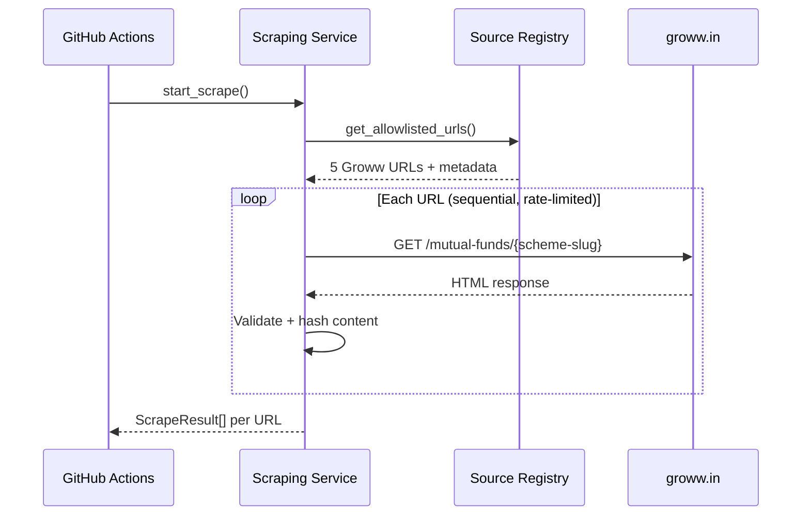
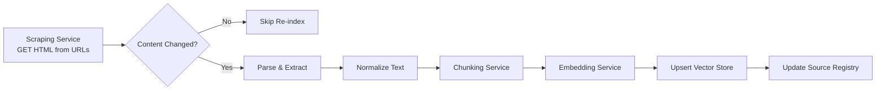
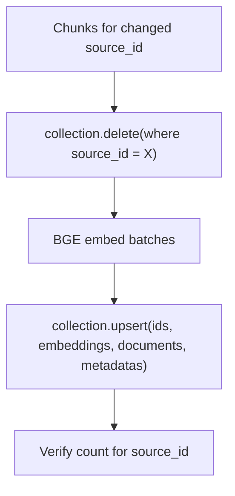
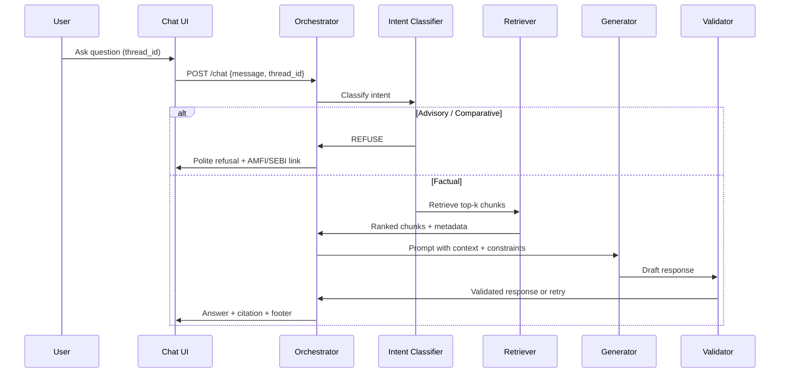
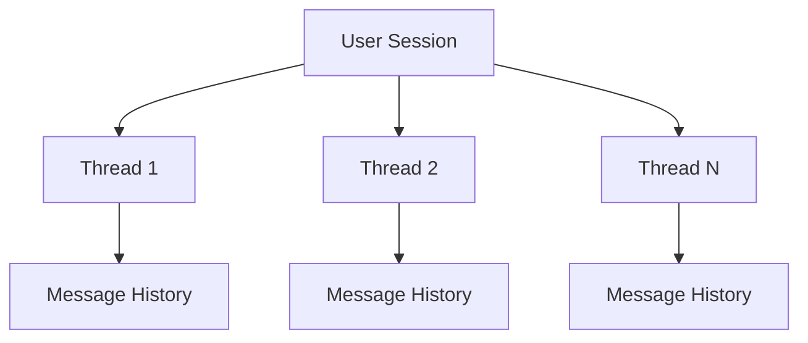
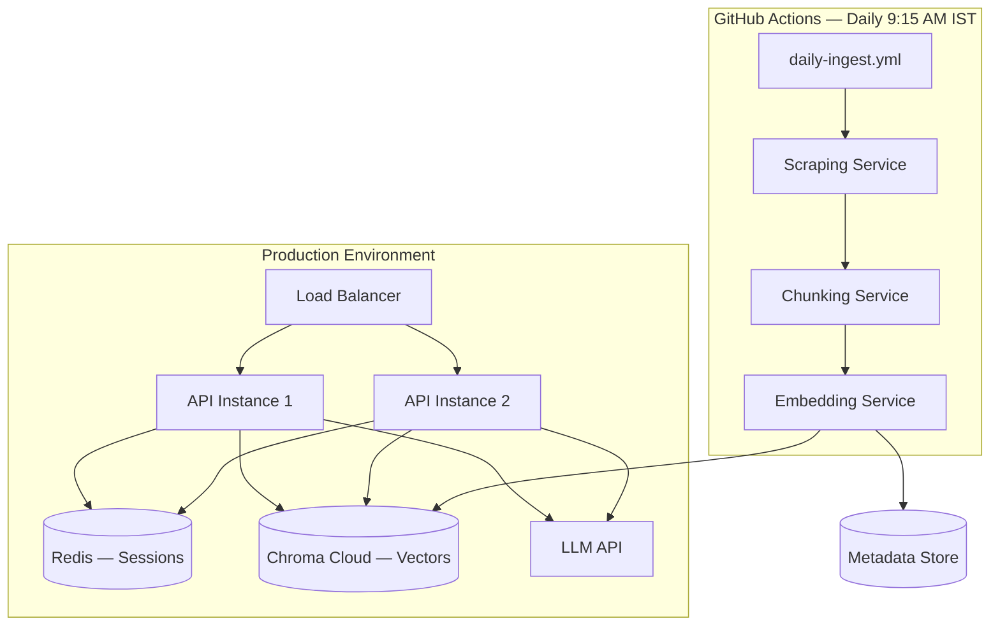

# RAG Architecture — Mutual Fund FAQ Assistant (Facts-Only Q&A)

## 1. Document Purpose

This document defines the end-to-end Retrieval-Augmented Generation (RAG) architecture for a **facts-only** mutual fund FAQ assistant, using Groww as the reference product context. The system answers objective, verifiable queries about mutual fund schemes by retrieving information exclusively from a **fixed, allowlisted corpus of five Groww scheme pages** for HDFC Mutual Fund (HTML only — no PDFs in current scope).

**Design principle:** Accuracy and compliance over conversational intelligence. The assistant prioritizes source-backed facts, strict refusal of advisory queries, and transparent citations.

---

## 2. Goals & Non-Goals

### Goals

| Goal | Description |
|------|-------------|
| Factual Q&A | Answer verifiable queries from Groww pages (expense ratio, exit load, SIP minimum, ELSS lock-in, riskometer, benchmark) |
| Source fidelity | Every answer cites exactly one allowlisted Groww scheme page URL |
| Compliance | No investment advice, opinions, comparisons, or return calculations |
| Transparency | Responses ≤ 3 sentences; footer with last-updated date |
| Multi-thread support | Handle multiple independent chat sessions concurrently |
| Refusal handling | Politely decline advisory/comparative queries with educational links |

### Non-Goals

- Personalized investment recommendations
- Portfolio analysis or performance predictions
- Third-party blog or non-allowlisted content ingestion
- PDF document ingestion (KIM, SID, factsheets) — **out of scope for v1**
- Collection of PII (PAN, Aadhaar, account numbers, OTPs, email, phone)
- Real-time NAV or live market data feeds beyond what is present on the indexed Groww pages

---

## 3. High-Level System Architecture



---

## 4. Corpus Definition

### 4.1 AMC & Scheme Selection (In Scope)

**AMC:** HDFC Mutual Fund

**Schemes:** 5 HDFC Direct Growth plans, sourced from Groww scheme pages with category diversity:

| # | Scheme Name | Category | Groww URL |
|---|-------------|----------|-----------|
| 1 | HDFC Mid Cap Fund Direct Growth | Mid-cap equity | https://groww.in/mutual-funds/hdfc-mid-cap-fund-direct-growth |
| 2 | HDFC Equity Fund Direct Growth | Equity (diversified) | https://groww.in/mutual-funds/hdfc-equity-fund-direct-growth |
| 3 | HDFC Focused Fund Direct Growth | Focused equity | https://groww.in/mutual-funds/hdfc-focused-fund-direct-growth |
| 4 | HDFC ELSS Tax Saver Fund Direct Plan Growth | ELSS (tax-saving) | https://groww.in/mutual-funds/hdfc-elss-tax-saver-fund-direct-plan-growth |
| 5 | HDFC Large Cap Fund Direct Growth | Large-cap equity | https://groww.in/mutual-funds/hdfc-large-cap-fund-direct-growth |

**Example query types per category:**

| Scheme Category | Example Query Types |
|-----------------|---------------------|
| Large-cap equity | Benchmark, expense ratio, riskometer |
| Mid-cap equity | Exit load, minimum SIP |
| Focused equity | Fund manager, minimum lump sum |
| ELSS (tax-saving) | Lock-in period, expense ratio |
| Diversified equity | Riskometer, benchmark index |

### 4.2 Source URL Inventory (5 URLs — HTML Only)

The v1 corpus consists of **exactly five Groww scheme pages**. No PDFs (factsheets, KIM, SID) are provided or ingested in this phase.

Each URL is registered in a **Source Registry** with structured metadata:

```yaml
source_id: "hdfc-large-cap-direct-growth"
url: "https://groww.in/mutual-funds/hdfc-large-cap-fund-direct-growth"
document_type: "scheme_page"    # Groww HTML scheme detail page
scheme_name: "HDFC Large Cap Fund Direct Growth"
scheme_category: "large-cap"
amc: "HDFC Mutual Fund"
plan_type: "Direct Growth"
content_format: "html"          # no PDF in v1
last_fetched: "2026-06-01"
language: "en"
```

**Full Source Registry (v1):**

```yaml
sources:
  - source_id: hdfc-mid-cap-direct-growth
    url: https://groww.in/mutual-funds/hdfc-mid-cap-fund-direct-growth
    scheme_name: HDFC Mid Cap Fund Direct Growth
    scheme_category: mid-cap

  - source_id: hdfc-equity-direct-growth
    url: https://groww.in/mutual-funds/hdfc-equity-fund-direct-growth
    scheme_name: HDFC Equity Fund Direct Growth
    scheme_category: diversified-equity

  - source_id: hdfc-focused-direct-growth
    url: https://groww.in/mutual-funds/hdfc-focused-fund-direct-growth
    scheme_name: HDFC Focused Fund Direct Growth
    scheme_category: focused-equity

  - source_id: hdfc-elss-tax-saver-direct-growth
    url: https://groww.in/mutual-funds/hdfc-elss-tax-saver-fund-direct-plan-growth
    scheme_name: HDFC ELSS Tax Saver Fund Direct Plan Growth
    scheme_category: elss

  - source_id: hdfc-large-cap-direct-growth
    url: https://groww.in/mutual-funds/hdfc-large-cap-fund-direct-growth
    scheme_name: HDFC Large Cap Fund Direct Growth
    scheme_category: large-cap
```

**Content available on Groww scheme pages (expected sections to extract):**

- Fund overview and category
- Expense ratio
- Exit load
- Minimum SIP / lump sum investment
- Lock-in period (ELSS)
- Riskometer
- Benchmark index
- Fund manager and AUM (factual fields only)

**Out of scope for v1 corpus:**

- PDF factsheets, KIM, SID
- AMC FAQ / help pages (statement download, tax reports)
- AMFI/SEBI guidance pages (used only as static educational links in refusal responses)

### 4.3 Source Allowlist Policy

Only the **five registered Groww URLs** above are ingested. The allowlist is an exact URL match (not open-domain crawling):

| Rule | Value |
|------|-------|
| Allowed domain | `groww.in` |
| Allowed path prefix | `/mutual-funds/` |
| Allowed URLs | Exactly the 5 entries in Source Registry |
| PDF ingestion | Disabled in v1 |
| AMFI/SEBI URLs | Compliance Link Registry only (refusal responses; not indexed) |

URLs outside the allowlist are rejected at crawl time and cannot appear as citations.

---

## 5. Offline Ingestion Pipeline

The ingestion pipeline is triggered **daily at 9:15 AM IST** by a **GitHub Actions workflow** (Scheduler Service). The workflow runs the Scraping Service to fetch latest HTML from all five allowlisted Groww URLs, then executes parse → chunk → embed → index stages. Chunking and embedding are documented in [Chunking & Embedding Architecture](./chunking-embedding-architecture.md).



### 5.1 Scheduler Service (GitHub Actions)

The Scheduler Service is implemented as a **GitHub Actions workflow** in `.github/workflows/daily-ingest.yml`. It replaces an in-app cron and runs the full ingestion pipeline on GitHub-hosted runners at a fixed time each day.

| Setting | Value |
|---------|-------|
| Platform | **GitHub Actions** |
| Workflow file | `.github/workflows/daily-ingest.yml` |
| Schedule | **Every day at 9:15 AM IST** |
| Cron expression (UTC) | `45 3 * * *` (9:15 AM IST = 3:45 AM UTC) |
| Manual trigger | `workflow_dispatch` in GitHub UI or GitHub CLI |
| Concurrency | `concurrency: ingest-pipeline` with `cancel-in-progress: false` |
| On failure | Workflow marked failed; GitHub notification; retry via `workflow_dispatch` |

**Workflow definition:**

```yaml
name: Daily Ingest Pipeline

on:
  schedule:
    # 9:15 AM IST = 3:45 AM UTC
    - cron: '45 3 * * *'
  workflow_dispatch:
    inputs:
      force_reindex:
        description: 'Re-index all URLs even if content hash unchanged'
        required: false
        default: 'false'
        type: boolean

concurrency:
  group: ingest-pipeline
  cancel-in-progress: false

jobs:
  ingest:
    runs-on: ubuntu-latest
    timeout-minutes: 30

    steps:
      - name: Checkout repository
        uses: actions/checkout@v4

      - name: Set up Python
        uses: actions/setup-python@v5
        with:
          python-version: '3.11'
          cache: 'pip'

      - name: Install dependencies
        run: pip install -r requirements-ingest.txt

      - name: Scrape → chunk → embed → Chroma Cloud
        env:
          EMBEDDING_PROVIDER: bge
          VECTOR_STORE_MODE: cloud
          CHROMA_API_KEY: ${{ secrets.CHROMA_API_KEY }}
          CHROMA_TENANT: ${{ secrets.CHROMA_TENANT }}
          CHROMA_DATABASE: ${{ secrets.CHROMA_DATABASE }}
          FORCE_REINDEX: ${{ github.event.inputs.force_reindex || 'false' }}
          GITHUB_RUN_ID: ${{ github.run_id }}
          INGEST_TRIGGER: ${{ github.event_name == 'schedule' && 'scheduled' || 'manual' }}
        run: python -m ingest run --summary /tmp/run-summary.json

      - name: Validate Chroma Cloud index
        if: success()
        env:
          EMBEDDING_PROVIDER: bge
          VECTOR_STORE_MODE: cloud
          CHROMA_API_KEY: ${{ secrets.CHROMA_API_KEY }}
          CHROMA_TENANT: ${{ secrets.CHROMA_TENANT }}
          CHROMA_DATABASE: ${{ secrets.CHROMA_DATABASE }}
        run: python -m rag validate-index --min-chunks 1

      - name: Upload run summary
        if: always()
        uses: actions/upload-artifact@v4
        with:
          name: ingest-run-summary-${{ github.run_id }}
          path: /tmp/run-summary.json
          retention-days: 30

      - name: Upload raw HTML snapshots
        if: success()
        uses: actions/upload-artifact@v4
        with:
          name: raw-html-${{ github.run_id }}
          path: data/raw/
          retention-days: 7
```

**Pipeline steps executed inside `python -m ingest run`:**

1. Load 5 URLs from Source Registry (`config/sources.yaml`)
2. **Scrape** — fetch HTML from each Groww URL (Scraping Service)
3. **Change detection** — compare content hash; skip unchanged unless `FORCE_REINDEX=true`
4. **Parse & normalize** — extract structured sections from HTML
5. **Chunk** — structure-aware chunking (see [chunking doc](./chunking-embedding-architecture.md))
6. **Embed** — batch embedding generation (see [embedding doc](./chunking-embedding-architecture.md))
7. **Index** — upsert vectors + metadata to **Chroma** collection `mf_faq_hdfc_groww` (see §5.6)
8. Update `last_fetched` in Source Registry; write run summary

**Environment variables (GitHub Actions):**

| Variable | Purpose |
|----------|---------|
| `EMBEDDING_PROVIDER` | Set to `bge` (default) for local `BAAI/bge-small-en-v1.5` embeddings |
| `CHROMA_API_KEY` | Chroma Cloud API key (**required** for all ingest and retrieval) |
| `CHROMA_TENANT` | Chroma Cloud tenant ID |
| `CHROMA_DATABASE` | Chroma Cloud database name (e.g. `testDB`) |
| `INGEST_TRIGGER` | `scheduled` (cron) or `manual` (`workflow_dispatch`) |
| `GITHUB_RUN_ID` | GitHub Actions run ID for run summary correlation |
| `CHROMA_HOST` | Optional; defaults to `api.trychroma.com` |
| `VECTOR_STORE_MODE` | `cloud` (default); set to `ephemeral` only for unit tests |
| `FORCE_REINDEX` | Re-index all URLs when `true` |
| `OPENAI_API_KEY` | Only required if `EMBEDDING_PROVIDER=openai` |

**Run summary artifact example:**

```json
{
  "run_id": "ingest-2026-06-05-091500",
  "trigger": "scheduled",
  "workflow_run_id": "12345678",
  "started_at": "2026-06-05T09:15:00+05:30",
  "completed_at": "2026-06-05T09:16:42+05:30",
  "urls_fetched": 5,
  "urls_changed": 2,
  "urls_failed": 0,
  "chunks_created": 48,
  "embeddings_upserted": 48,
  "status": "success"
}
```

**Local development:** Run the same pipeline against **Chroma Cloud** (no local vector DB). Export `CHROMA_*` credentials, then:

```bash
export VECTOR_STORE_MODE=cloud
export CHROMA_API_KEY=...
export CHROMA_TENANT=...
export CHROMA_DATABASE=mf-faq-prod
python -m ingest run
python -m rag validate-index
```

### 5.2 Scraping Service

The Scraping Service fetches raw HTML from the allowlisted Groww scheme URLs. It is the **only component** that makes outbound HTTP requests to `groww.in`.

**Responsibilities:**

- Read URL list from Source Registry (5 fixed URLs)
- Fetch HTML via HTTP GET for each URL
- Validate response (status 200, `text/html`, non-empty body)
- Compute content hash (SHA-256) for change detection
- Return structured scrape results to the ingestion pipeline

**Scrape request flow:**



**Scrape result schema:**

```json
{
  "source_id": "hdfc-large-cap-direct-growth",
  "url": "https://groww.in/mutual-funds/hdfc-large-cap-fund-direct-growth",
  "status": "success",
  "http_status": 200,
  "html": "<html>...</html>",
  "content_hash": "a1b2c3...",
  "fetched_at": "2026-06-05T09:15:12+05:30",
  "error": null
}
```

**Scraping rules:**

| Rule | Value |
|------|-------|
| Allowed URLs | Exactly 5 entries from Source Registry |
| HTTP method | GET only |
| User-Agent | Identifiable bot UA (e.g., `MF-FAQ-Bot/1.0`) |
| Rate limiting | 1 request/sec to `groww.in` (sequential fetch) |
| Timeout | 30 seconds per URL |
| Retries | 2 retries with exponential backoff (2s, 4s) on 5xx / timeout |
| Link following | Disabled — no recursive crawling |
| PDF fetching | Disabled in v1 |
| robots.txt | Respect `groww.in/robots.txt` |

**Error handling per URL:**

| Failure | Action |
|---------|--------|
| HTTP 4xx/5xx after retries | Mark URL `failed`; keep previous index; log alert |
| Timeout | Same as above |
| Empty or non-HTML body | Reject scrape; do not update index |
| URL not in allowlist | Reject at scrape initiation (hard block) |

On partial failure (e.g., 4/5 URLs succeed), the pipeline updates changed pages and retains the previous index for failed URLs. The chat API remains available using the last successful index.

**Optional raw snapshot store:** Persist fetched HTML to `data/raw/{source_id}/{YYYY-MM-DD}.html` for debugging and audit (configurable; enabled in staging).

### 5.3 Pipeline Stages

After the Scraping Service returns HTML, the ingestion pipeline processes each URL:



**Change detection:** Compare new `content_hash` from Scraping Service against stored hash per `source_id`. Re-index only when hash differs.

### 5.4 Document Parsing & Normalization

1. Extract title, headings, and body text from Groww HTML
2. Detect and flatten tables (expense ratio, exit load slabs, SIP minimums)
3. Normalize units (%, ₹, days, months)
4. Strip boilerplate (cookie banners, disclaimers duplicated across pages)
5. Output **section blocks** (one per Groww page section) as input to the Chunking Service

### 5.5 Chunking & Embedding (Separate Architecture)

Chunking and embedding are documented in detail in **[Chunking & Embedding Architecture](./chunking-embedding-architecture.md)**.

| Stage | Summary |
|-------|---------|
| **Chunking** | Structure-aware splitting of Groww section blocks into 400–600 token chunks with metadata |
| **Embedding** | Batch vectorization via `BAAI/bge-small-en-v1.5` (384-dim, local); upsert to Chroma collection `mf_faq_hdfc_groww` |
| **Runs inside** | GitHub Actions `ingest` job (`python -m ingest run`) after scrape + parse |

### 5.6 Vector Store — Chroma Cloud (Phase 5.3)

**Phase 5.3** uses **[Chroma Cloud](https://www.trychroma.com/)** as the **only** vector store for this project. There is **no local Chroma database** (`data/chroma` / `PersistentClient`) in dev, staging, or production. All ingest and retrieval traffic goes to a managed Cloud database via `chromadb.CloudClient`.

| Environment | Chroma deployment | Client |
|-------------|-------------------|--------|
| **dev** | [Chroma Cloud](https://www.trychroma.com/) (same database or a dev database) | `chromadb.CloudClient` |
| **staging / prod** | Chroma Cloud | `chromadb.CloudClient` |
| **GitHub Actions** | Chroma Cloud (daily ingest upserts via API) | `chromadb.CloudClient` |
| **unit tests only** | In-memory (not persisted) | `chromadb.EphemeralClient` via `VECTOR_STORE_MODE=ephemeral` |

**Data upload model:** Groww HTML is scraped and processed on the runner (GitHub Actions or your laptop); only **embeddings + chunk text + metadata** are sent to Chroma Cloud through `collection.upsert()` over HTTPS (`api.trychroma.com`). Nothing is uploaded manually through the Chroma web UI.

**Why Chroma Cloud for v1:**

- No local vector DB to install, sync, or back up
- Dev, CI, and prod all read/write the same Cloud collection schema
- Metadata filters (`where`) align with scheme-level pre-filtering (`source_id`, `scheme_name`, `section_key`)
- Managed ops: GitHub Actions pushes index updates daily at 9:15 AM IST
- Future option: native sparse/BM25 vectors in Chroma for the hybrid retrieval sparse leg (Phase 5.2 currently uses in-memory BM25)

**Collection schema:**

| Property | Value |
|----------|-------|
| Collection name | `mf_faq_hdfc_groww` |
| Point ID | `chunk_id` (string) |
| Embedding | 384-dim cosine (BGE-small, normalized) |
| Document field | Chunk `text` (for full-text / display) |
| Metadata | `source_id`, `source_url`, `scheme_name`, `scheme_category`, `section_key`, `section_heading`, `document_type`, `token_count`, `content_hash`, `indexed_at` |
| Distance | Cosine (`hnsw:space: cosine`) |

**Upsert flow (unchanged semantics, Chroma backend):**



**Phase 5.3 — implemented (Cloud-only):**

| Step | Task | Status |
|------|------|--------|
| 5.3.1 | Provision Chroma Cloud tenant, database, and API key | Ops — GitHub secrets |
| 5.3.2 | `config/embedding.yaml` → `vector_store.mode: cloud`, `tenant`, `database` | ✅ |
| 5.3.3 | `vector_store.py` + `chroma_client.py` → `CloudClient` only (no local `PersistentClient` in runtime) | ✅ |
| 5.3.4 | `CHROMA_*` env vars in `daily-ingest.yml` and local dev | ✅ |
| 5.3.5 | `FORCE_REINDEX=true` ingest seeds Cloud collection `mf_faq_hdfc_groww` | One-time ops |
| 5.3.6 | `python -m rag validate-index` — Cloud reachability + metadata checks | ✅ |
| 5.3.7 | Unit tests use `VECTOR_STORE_MODE=ephemeral` only | ✅ |

**Chroma Cloud connection (target pattern):**

```python
import chromadb

client = chromadb.CloudClient(
    tenant=os.environ["CHROMA_TENANT"],
    database=os.environ["CHROMA_DATABASE"],
    api_key=os.environ["CHROMA_API_KEY"],
)
collection = client.get_or_create_collection(
    name="mf_faq_hdfc_groww",
    metadata={"hnsw:space": "cosine"},
)
```

**Query-time access:** The Hybrid Retriever (Phase 5.2) reads the same Chroma collection for dense vector search; BM25 sparse search remains in-process until a later optional migration to Chroma sparse vectors.

**Failure handling:**

| Failure | Action |
|---------|--------|
| Chroma Cloud unreachable | Fail ingest job; retain last successful index; alert |
| Auth / tenant mismatch | Fail fast with clear log; do not partial-upsert |
| Collection dimension mismatch | Drop and recreate collection; `FORCE_REINDEX=true` |
| Partial URL failure (4/5) | Upsert only changed schemes; others unchanged in Chroma |

---

## 6. Online Query Pipeline

### 6.1 End-to-End Request Flow



### 6.2 Intent Classification

A lightweight classifier runs **before** retrieval to gate advisory queries.

**Classification categories:**

| Intent | Action | Examples |
|--------|--------|----------|
| `FACTUAL_SCHEME` | Proceed to RAG | "What is the expense ratio of X?" |
| `FACTUAL_PROCESS` | Proceed to RAG if in corpus; else not found | "What is the minimum SIP for X?" |
| `PERFORMANCE` | Groww scheme page link only | "What returns did X give last year?" |
| `ADVISORY` | Refuse | "Should I invest in X?" |
| `COMPARATIVE` | Refuse | "Which fund is better, X or Y?" |
| `OUT_OF_SCOPE` | Refuse | "What stock should I buy?" |

**Implementation options (in order of preference):**

1. **Rule-based + keyword patterns** — fast, auditable, no extra model cost
2. **Small LLM classifier** — few-shot prompt with strict JSON output
3. **Fine-tuned classifier** — only if scale demands it

**Advisory signal patterns:** "should I", "better", "recommend", "best fund", "worth investing", "buy or sell"

### 6.3 Retrieval Strategy

Use **hybrid retrieval** for financial terminology and exact figures:

```
final_score = α * dense_score + (1 - α) * sparse_score
```

| Parameter | Value |
|-----------|-------|
| α (dense weight) | 0.7 |
| Top-k retrieved | 10 |
| Top-k after rerank | 3–5 |
| Similarity threshold | 0.65 (below → "not found" response) |

**Retrieval filters (pre-filter):**

- `scheme_name` — when detected via NER or user mention
- `document_type` — `scheme_page` (all v1 chunks)
- `section_heading` — e.g., "Exit Load", "Expense Ratio", "Minimum Investment"
- `source_allowlist = true`

**Query enhancement:**

1. Spell-correct fund names against scheme registry
2. Expand abbreviations (ELSS → Equity Linked Savings Scheme)
3. Do **not** expand into advisory framing

### 6.4 Reranking

Pass top-10 candidates through a cross-encoder reranker (e.g., `ms-marco-MiniLM-L-6-v2`) to improve precision on dense financial text.

### 6.5 Context Assembly

Build a minimal context window for the generator:

```
[Chunk 1 — source: {url}, section: {heading}]
{chunk text}

[Chunk 2 — source: {url}, section: {heading}]
{chunk text}

...
```

**Rules:**

- Max 2,000 tokens of retrieved context
- Prefer single-source chunks when possible (simplifies citation requirement)
- If multiple schemes detected, ask user to clarify (do not blend sources)

---

## 7. Generation Layer

### 7.1 Constrained Generation Prompt

The system prompt enforces facts-only behavior:

```
You are a facts-only mutual fund FAQ assistant. You answer objective questions
using ONLY the provided context from the indexed Groww scheme pages.

RULES:
1. Answer in maximum 3 sentences.
2. Include exactly ONE source link from the provided context (must be a Groww
   scheme page URL from the allowlist).
3. Do NOT provide investment advice, opinions, or recommendations.
4. Do NOT compare funds or calculate returns.
5. If the context does not contain the answer, say you cannot find that
   information on the indexed Groww pages and link to the relevant scheme page.
6. Use plain language suitable for retail investors.
7. Only answer about the 5 HDFC schemes in scope.
```

### 7.2 Performance Query Handling

For `PERFORMANCE` intent:

> "For historical performance data, please refer to the scheme page: [link]. I can only share factual scheme details, not performance analysis."

Link points to the scheme's Groww page URL from the Source Registry — no return figures in the response.

### 7.3 Response Template

```
{answer_text — max 3 sentences}

Source: {single_groww_scheme_url}

Last updated from sources: {YYYY-MM-DD}
```

The `last_updated` date is the **max** `last_fetched` date across chunks used in the answer.

---

## 8. Refusal Handling

### 8.1 Refusal Response Structure

```
{polite_refusal_message}

For general investor education, see: {AMFI_or_SEBI_link}
```

### 8.2 Refusal Templates

| Intent | Template |
|--------|----------|
| `ADVISORY` | "I can only answer factual questions about mutual fund schemes, not provide investment advice. For investor awareness, visit: [AMFI link]" |
| `COMPARATIVE` | "I cannot compare funds or suggest which is better. I can answer specific factual questions about individual schemes. Learn more: [SEBI link]" |
| `OUT_OF_SCOPE` | "That question is outside my scope. I answer factual queries about five HDFC schemes using indexed Groww scheme pages." |

Educational links are pre-configured in a static **Compliance Link Registry** (not retrieved via RAG).

---

## 9. Response Validation (Guardrails)

A post-generation validator runs before returning any response to the user.

### 9.1 Validation Checks

| Check | Rule | On Failure |
|-------|------|------------|
| Sentence count | ≤ 3 sentences | Truncate or regenerate |
| Citation count | Exactly 1 URL | Regenerate with explicit instruction |
| URL validity | URL ∈ Source Registry or Compliance Registry | Strip invalid links, regenerate |
| Advisory language | No "you should invest", "I recommend", "better choice" | Block and return refusal template |
| Performance data | No return %, CAGR, or ranking | Replace with Groww scheme page link response |
| PII detection | No PAN/Aadhaar/account patterns | Block response, log incident |
| Grounding | Answer entities appear in retrieved context | Regenerate or return "not found" |

### 9.2 Regeneration Policy

- Max 2 regeneration attempts with tightened prompt
- After 2 failures → safe fallback: "I couldn't verify this from the indexed Groww pages. Please refer to the scheme page: [link]"

---

## 10. Multi-Thread Conversation Support

### 10.1 Thread Model



Each `thread_id` maintains:

- Ordered message history (user + assistant)
- Scheme context (if user is discussing a specific fund)
- Last retrieved source IDs (for follow-up disambiguation)

### 10.2 Context Window for Follow-Ups

| History Use | Policy |
|-------------|--------|
| Last 3 turns | Include in query rewriting for follow-ups ("What about its exit load?") |
| Scheme resolution | Carry forward `scheme_name` from prior turn if not mentioned |
| Retrieval | Re-retrieve each turn (do not cache answers across different factual questions) |
| Advisory drift | Re-run intent classifier every turn |

### 10.3 Session Store

| Field | Storage |
|-------|---------|
| `thread_id` | UUID |
| `messages` | JSON array (role, content, timestamp, citation) |
| `created_at` / `updated_at` | ISO 8601 |
| TTL | 24 hours (configurable) |

Backend: Redis or in-memory dict (development); Redis/PostgreSQL (production).

**Privacy:** No PII fields in session schema. Thread IDs are anonymous.

---

## 11. User Interface (Minimal)

### 11.1 UI Components

```
┌─────────────────────────────────────────────────────┐
│  Mutual Fund FAQ Assistant                          │
│  ┌───────────────────────────────────────────────┐  │
│  │ ⚠ Facts-only. No investment advice.          │  │
│  └───────────────────────────────────────────────┘  │
│                                                     │
│  Welcome! Ask factual questions about five HDFC     │
│  mutual fund schemes. I answer using indexed Groww   │
│  scheme pages only.                                 │
│                                                     │
│  Try asking:                                        │
│  • What is the expense ratio of HDFC Large Cap Fund?│
│  • What is the minimum SIP for HDFC Mid Cap Fund?   │
│  • What is the ELSS lock-in period for HDFC ELSS?   │
│                                                     │
│  ┌───────────────────────────────────────────────┐  │
│  │  Chat messages...                             │  │
│  └───────────────────────────────────────────────┘  │
│                                                     │
│  [ Type your question...                    ] [Send]│
└─────────────────────────────────────────────────────┘
```

### 11.2 UI Requirements

- Persistent disclaimer visible at all times
- Clickable citation links (open in new tab)
- Thread selector or "New conversation" button
- Loading state during retrieval + generation
- Error state for network/index failures

---

## 12. API Design

### 12.1 Endpoints

| Method | Path | Description |
|--------|------|-------------|
| `POST` | `/api/chat` | Send message; returns answer |
| `POST` | `/api/threads` | Create new thread |
| `GET` | `/api/threads/{id}` | Get thread history |
| `DELETE` | `/api/threads/{id}` | Clear thread |
| `GET` | `/api/health` | System health (index status, last scrape run) |
| GitHub Actions | `workflow_dispatch` on `daily-ingest.yml` | On-demand scrape + re-index (manual trigger) |

### 12.2 Chat Request/Response

**Request:**

```json
{
  "thread_id": "uuid",
  "message": "What is the expense ratio of HDFC Large Cap Fund?"
}
```

**Response (factual):**

```json
{
  "thread_id": "uuid",
  "answer": "The expense ratio of HDFC Large Cap Fund Direct Growth is listed on its Groww scheme page.",
  "citation": "https://groww.in/mutual-funds/hdfc-large-cap-fund-direct-growth",
  "last_updated": "2026-06-01",
  "intent": "FACTUAL_SCHEME"
}
```

**Response (refusal):**

```json
{
  "thread_id": "uuid",
  "answer": "I can only answer factual questions about mutual fund schemes, not provide investment advice.",
  "citation": "https://www.amfiindia.com/investor-awareness",
  "last_updated": null,
  "intent": "ADVISORY"
}
```

---

## 13. Technology Stack (Recommended)

| Layer | Technology Options |
|-------|-------------------|
| Frontend | React / Next.js or Streamlit (minimal) |
| Backend API | FastAPI (Python) |
| LLM | OpenAI GPT-4o-mini / Azure OpenAI / local Llama 3 (with strict guardrails) |
| Embeddings | HuggingFace `BAAI/bge-small-en-v1.5` via `sentence-transformers` (primary); OpenAI optional |
| Vector DB | [Chroma Cloud](https://www.trychroma.com/) only (`chromadb.CloudClient`; no local DB) |
| Document parsing | BeautifulSoup, Trafilatura (HTML only; no PDF parser in v1) |
| Reranker | `sentence-transformers` cross-encoder |
| Session store | Redis |
| Orchestration | LangChain or LlamaIndex (optional) or custom thin wrapper |
| Scheduler | GitHub Actions (`daily-ingest.yml`, cron `45 3 * * *` UTC = 9:15 AM IST) |
| Scraping | `httpx` or `requests` + BeautifulSoup / Trafilatura |
| Deployment | Docker + single VM or managed container service |

---

## 14. Security, Privacy & Compliance

### 14.1 Data Handling

| Data | Policy |
|------|--------|
| User questions | Ephemeral session storage; optional anonymized logging |
| PII | Never collected; regex scanner on input and output |
| Source documents | Public Groww HTML pages only; no PDFs; no licensing concerns |
| API keys | Environment variables / secrets manager |

### 14.2 Compliance Controls

- Static disclaimer in UI: **"Facts-only. No investment advice."**
- No performance calculations in code or prompts
- Audit log: query, intent, source URL cited, timestamp (no user identity)
- Source Registry versioned for reproducibility

### 14.3 Threat Mitigations

| Threat | Mitigation |
|--------|------------|
| Prompt injection | Context delimiters; system prompt isolation; output validation |
| URL injection in citations | Allowlist validation against Source Registry |
| Hallucinated facts | Grounding check; similarity threshold; regeneration limits |
| Scraping abuse | Rate limiting on `/api/chat` |

---

## 15. Deployment Architecture



**Environments:** `dev`, `staging`, and `prod` all use **Chroma Cloud** for vectors (dev may use a separate Cloud database). Session store: in-memory (dev) or Redis (prod).

---

## 16. Monitoring & Evaluation

### 16.1 Key Metrics

| Metric | Target |
|--------|--------|
| Retrieval precision@3 | ≥ 0.85 on labeled test set |
| Citation accuracy | 100% URLs from Source Registry |
| Advisory refusal rate | 100% on advisory test prompts |
| Response latency (p95) | < 5 seconds |
| Hallucination rate | < 2% on eval set |
| Daily scrape success rate | 100% of 5 URLs fetched |
| Scrape job completion | By 9:20 AM IST (p95) |
| Index freshness | `last_fetched` ≤ 24 hours |

### 16.2 Evaluation Dataset

Build 25–35 labeled Q&A pairs from the five Groww pages:

- 15 factual scheme questions with expected Groww citation (expense ratio, exit load, SIP, lock-in, riskometer, benchmark)
- 5 cross-scheme coverage checks (one question per scheme)
- 8 advisory/comparative questions (must refuse)
- 4 performance questions (Groww scheme page link only; no return figures)
- 3 edge cases (scheme not in corpus, ambiguous scheme name, missing field on page)

**Extended catalog:** See [Edge Cases — Evaluation Catalog](./edge-cases-evaluation.md) for 158 labeled cases across scope, intent, retrieval, compliance, ingestion, security, and multi-turn flows.

---

## 17. Known Limitations

| Limitation | Impact | Mitigation |
|------------|--------|------------|
| Static corpus (5 URLs) | Answers may lag Groww page updates between daily runs | Daily scrape at 9:15 AM IST; display `last_updated` / `last_fetched` date |
| HTML-only, no PDFs | No KIM/SID/factsheet depth; some fields may be absent | State v1 scope in welcome message; link to Groww scheme page |
| Single AMC, 5 schemes | Cannot answer questions about other AMCs or schemes | State scope in welcome message; refuse out-of-scope |
| Groww page structure | DOM changes can break extraction | Section-level parsing with fallback selectors; ingestion tests |
| Scheme name ambiguity | User may say "HDFC Equity" vs full plan name | Map aliases to Source Registry; ask clarifying question |
| No real-time NAV | NAV on page may be stale | Cite Groww page; do not compute or extrapolate |
| Process/how-to queries | Statement download, tax reports not in corpus | Return "not found" with scheme page link |
| English only | No Hindi/regional language support | Future enhancement |

---

## 18. Implementation Phases

### 18.1 Release phases (weeks)

| Phase | Deliverables | Duration |
|-------|--------------|----------|
| **Phase 1 — Corpus** | 5 Groww URLs, Source Registry, GitHub Actions scheduler, Scraping Service | Week 1 |
| **Phase 2 — RAG Core** | Chunking Service, Embedding Service, vector index, hybrid retrieval (see [chunking doc](./chunking-embedding-architecture.md)) | Week 2 |
| **Phase 3 — Generation** | Intent classifier, constrained prompts, validator | Week 2–3 |
| **Phase 4 — API & Threads** | Chat API, session management, refusal flows | Week 3 |
| **Phase 5 — UI** | Minimal chat interface, disclaimer, example questions | Week 3–4 |
| **Phase 6 — Eval & Hardening** | Test suite, guardrail tuning, README | Week 4 |

### 18.2 Delivery milestones (5.x)

Incremental build milestones within Phase 2 / RAG Core:

| Milestone | Status | Deliverables |
|-----------|--------|--------------|
| **5.0 — Scheduler + Scraping** | ✅ Done | Source Registry, `daily-ingest.yml`, Scraping Service, `python -m ingest scrape-only` |
| **5.1 — Chunking + Embedding** | ✅ Done | Groww parser, structure-aware chunking, BGE embeddings |
| **5.2 — Hybrid retrieval + validation** | ✅ Done | BM25 + dense fusion, reranker, `validate-index`, golden query runner |
| **5.3 — Chroma Cloud vector store** | ✅ Done | Cloud-only index; `CloudClient`; `CHROMA_*` secrets; see §5.6 |
| **5.4 — Generation** | ✅ Done | Intent classifier, extractive/OpenAI generator, response validator (§6–9) |
| **Phase 3 — Generation** | ✅ Done | `phases/phase3_generation/` |
| **Phase 4 — API & Threads** | ✅ Done | FastAPI `/api/chat`, session store, orchestrator |
| **Phase 5 — UI** | ✅ Done | Minimal chat UI at `/` via `python -m api` |
| **Phase 6 — Eval** | ✅ Done | `eval_queries.yaml`, `python -m rag eval` |

---

## 19. Component Dependency Map

```
GitHub Actions Scheduler (daily 9:15 AM IST)
    └── Scraping Service
            └── Source Registry (URL list)
                    └── Parse & Normalize
                            └── Chunking Service → Embedding Service
                                    └── Chroma Cloud + Metadata Store
                    └── Retriever
                            └── Context Assembler
                                    └── Generator
                                            └── Response Validator
                                                    └── Chat API
                                                            └── UI

Intent Classifier ──► Refusal Handler ──► Chat API
Compliance Link Registry ──► Refusal Handler
Session Store ──► Chat API
```

---

## 20. Summary

This architecture delivers a **compliance-first RAG assistant** where:

1. **Retrieval** is scoped to five allowlisted Groww HTML scheme pages, indexed in **Chroma** and refreshed daily at 9:15 AM IST via GitHub Actions (scrape → chunk → embed pipeline; no PDFs in v1)
2. **Intent classification** blocks advisory queries before generation
3. **Constrained generation** enforces brevity, single citations, and facts-only language
4. **Post-generation validation** catches hallucinations, advisory drift, and invalid citations
5. **Multi-thread sessions** support independent conversations without PII collection

The result is a trustworthy, transparent FAQ assistant that prioritizes verifiable accuracy over open-ended conversational ability — aligned with the project's success criteria and regulatory context for retail investor communications.
